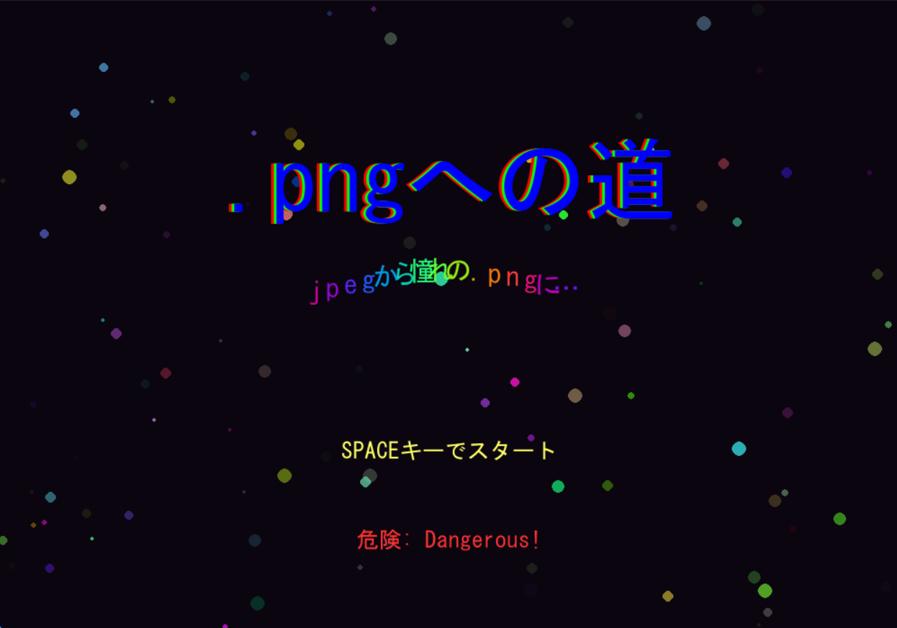

# .png への道

## 実行環境の必要条件

- python >= 3.10
- pygame >= 2.1

## ゲームの概要

- 主人公キャラクター cat(.jpeg)が.png になるために冒険するゲーム
- 参考 URL：[不思議のダンジョンとは？
  ](https://www.pokemon.co.jp/ex/dungeon_magnagate/outline/)

## ゲームの遊び方

- wasd で cat を操作、Shift でダッシュ
- 敵を倒して、レベルを上げて最上階を目指してください

### 共通基本機能

- ランダムで生成されるマップとランダムで更新できるマップ（担当：髙田）

### 分担追加機能

*階層構造：階段を設置して階層を移動（担当：髙田）
*プレイヤーの移動：wasd による移動＋ shift でダッシュ+カメラの追従（担当：西澤）

- 罠：マップのどこかにダメージの異なる罠を設置（透明）（担当：武沢）
- タイトル画面：タイトル画面の作成（担当：武沢）
- 敵クラス：マップ内の部屋に１対の敵をランダムな場所に描画（担当：フィッシャー）
- プレイヤーのパラメーターを取得するクラスの作成(担当：森本）
- レベルを参照しステータスを決定する関数の作成(担当：森本)
- 経験値が一定を超えた場合レベルアップする関数の作成(担当：森本)

### メモ

*マップはランダムで生成されている
*罠は T キーで可視化することができる
